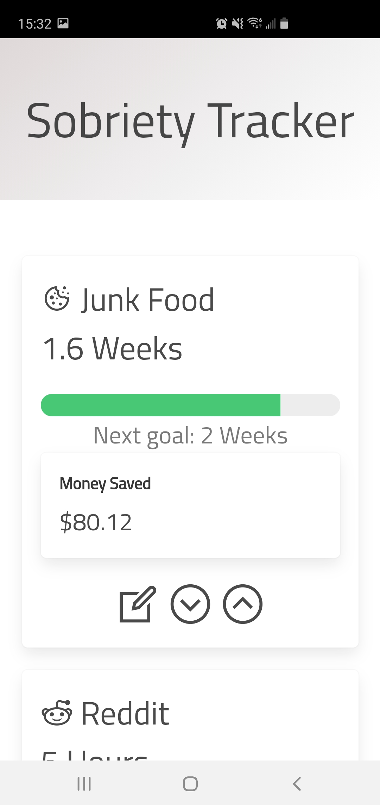
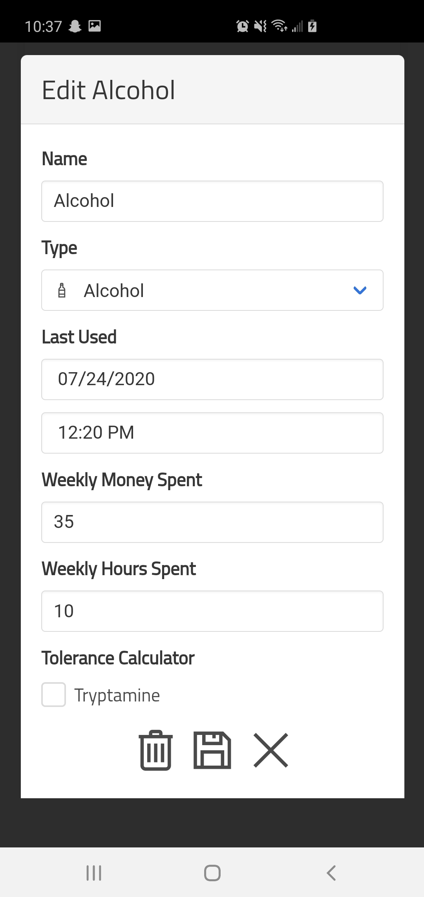

# Sobriety Tracker

An Android app to help count the time sober from any addiction.
[Get it at Google Play](https://play.google.com/store/apps/details?id=io.itsmaxymoo.sobrietytracker).

# About

This app was written as an Android WebView app, and is essentially
a website within an Android container. The code is self-documenting.

Main Screen | Editor | Types | PIN Protection
:---:|:---:|:---:|:---:
|  |  |  | 

# Tryptamine Tolerance

Sobriety Tracker has a built-in Tryptamine (LSD, Mushroom, etc...)
tolerance calculator. To enable it, simply check the "Tryptamine" box
in the addiction editor. Your tolerance will then automatically be displayed.

To make use of this, simply multiply the tolerance percent by the new desired dose, to get the actual dose required to feel the desired effects.
